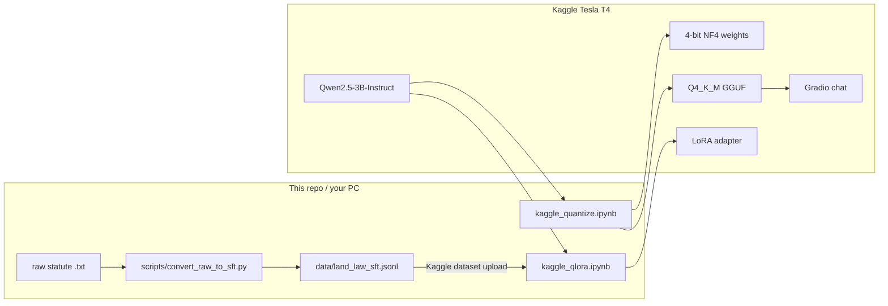
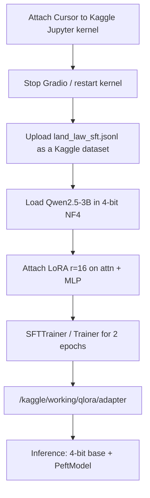
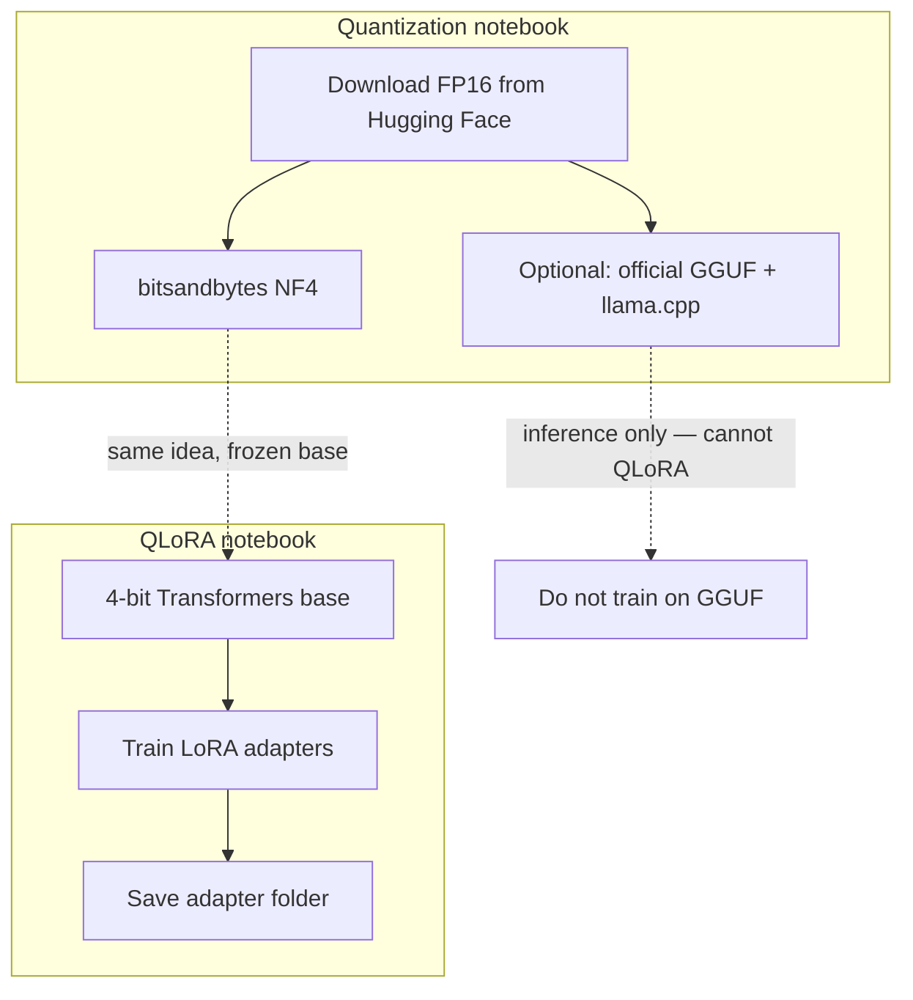

# QLoRA with Qwen2.5-3B-Instruct

Fine-tune [Qwen2.5-3B-Instruct](https://huggingface.co/Qwen/Qwen2.5-3B-Instruct) on a **Kaggle Tesla T4** using QLoRA, with a Bangladesh land-law SFT dataset built from public statute text.

This repository stores **code and training data only**. Model weights, GGUF files, zip archives, Hugging Face caches, LoRA adapters, and secrets (`.env`, tokens) are gitignored and must stay on Kaggle or your machine.

## What you get

| Artifact | Lives where | Purpose |
|---|---|---|
| Notebooks + converter | This repo | Reproduce the pipeline |
| `data/land_law_sft.jsonl` | This repo | 1,121 chat examples for SFT |
| 4-bit bitsandbytes model | Kaggle `/kaggle/working/quantized/` | Transformers inference |
| Official Q4_K_M GGUF | Kaggle `/kaggle/working/gguf/` | llama.cpp / Gradio chat |
| QLoRA adapter | Kaggle `/kaggle/working/qlora/adapter` | Load on top of 4-bit base |

These three weight formats are **not interchangeable**. llama.cpp cannot load bitsandbytes folders; QLoRA adapters are PEFT weights, not a new full model.

## Architecture



End-to-end **training** path (what QLoRA actually uses):



Quantization vs fine-tune vs chat:



## Repository layout

```
.
├── kaggle_quantize.ipynb      # Download, 4-bit quantize, GGUF, Gradio
├── kaggle_qlora.ipynb         # QLoRA SFT on land-law JSONL
├── scripts/convert_raw_to_sft.py
├── data/land_law_sft.jsonl
├── raw/                       # Public Bangladesh statute scrapes
└── README.md
```

## Dataset

`scripts/convert_raw_to_sft.py` parses `raw/*.txt`, strips site chrome, splits on section numbers, and writes chat rows:

```json
{"messages": [
  {"role": "user", "content": "What does Section 3 of the Transfer of Property Act, 1882 say?"},
  {"role": "assistant", "content": "Section 3 of the Transfer of Property Act, 1882 provides: ..."}
]}
```

Each section typically becomes two or three prompts (`What does…`, `Quote…`, `explain the provision on…`).

| Source file | Labeled as | Rows in JSONL |
|---|---|---|
| `SAT_1950_raw.txt` | State Acquisition and Tenancy Act, 1950 | 526 |
| `TPA_1882_raw.txt` | Transfer of Property Act, 1882 | 365 |
| `ARIPA_2017_raw.txt` | Acquisition and Requisition of Immovable Property Ordinance, 1982 | 130 |
| `NAT_1949_raw.txt` | Non-Agricultural Tenancy Act, 1949 | 92 |
| `Land_Tax_2023_raw.txt` | Land Development Tax Ordinance, 1976 | 8 |
| **Total** | | **1,121** |

Rebuild locally:

```bash
python scripts/convert_raw_to_sft.py
```

Attach the JSONL to the Kaggle notebook (example path used in training):

`/kaggle/input/datasets/mdraiyanbuhiyaloreen/dataset-land-law/land_law_sft.jsonl`

## How to run on Kaggle

Compute happens on **Kaggle**, not on your laptop. Cursor only edits the notebooks.

1. On Kaggle: GPU **T4 or P100**, Internet **on**, start the session.
2. Copy the **VS Code Compatible URL** (ends in `/proxy`). Do not commit that URL; it is a live session token.
3. In Cursor: **Notebook: Select Notebook Kernel → Existing Jupyter Server** → paste → pick **Python 3**.
4. Confirm with:

```python
from pathlib import Path
import torch
print("kaggle", Path("/kaggle/working").exists())
print("cuda", torch.cuda.is_available())
```

You want `kaggle True` and `cuda True`.

### Quantize + optional chat UI

Open `kaggle_quantize.ipynb` and run from the top.

- Downloads the model to `/kaggle/working/hf`
- Loads 4-bit NF4 on the T4 (~1.9 GB VRAM for 3B)
- Writes `/kaggle/working/quantized/Qwen__Qwen2.5-3B-Instruct`
- Zips to `Qwen__Qwen2.5-3B-Instruct-bnb4bit.zip` (~1.73 GB)
- Later cells download official `qwen2.5-3b-instruct-q4_k_m.gguf` and can launch Gradio (`share=True`). Use the `*.gradio.live` link, not `localhost`.

vLLM was tried and dropped: current PyPI wheels need CUDA 13 (`libcudart.so.13`); Kaggle T4 images are CUDA 12.

### QLoRA fine-tune

1. Stop Gradio if it is running.
2. **Restart the kernel** so GPU memory is empty; re-select the Kaggle kernel.
3. Open `kaggle_qlora.ipynb` and run all cells.

Settings that completed on T4:

| Setting | Value |
|---|---|
| Base | Qwen2.5-3B-Instruct, NF4 + double quant |
| LoRA | r=16, α=32, dropout 0.05, q/k/v/o/gate/up/down_proj |
| Data | 1,121 rows, max sequence 768 |
| Optim | paged_adamw_8bit, lr 2e-4, cosine, 2 epochs |
| Batch | 1 × 8 gradient accumulation |
| Precision | `fp16=False`, `bf16=False` (T4 AMP cannot unscale mixed grads) |

Recorded run: **~39.5 min**, train loss **0.922**, mean token accuracy **86.4%**, adapter at `/kaggle/working/qlora/adapter`.

Reload later (still on a GPU with bitsandbytes):

```python
from peft import PeftModel
from transformers import AutoModelForCausalLM, AutoTokenizer, BitsAndBytesConfig
import torch

bnb = BitsAndBytesConfig(
    load_in_4bit=True,
    bnb_4bit_quant_type="nf4",
    bnb_4bit_use_double_quant=True,
    bnb_4bit_compute_dtype=torch.float16,
)
base = AutoModelForCausalLM.from_pretrained(
    "Qwen/Qwen2.5-3B-Instruct",
    quantization_config=bnb,
    device_map="auto",
)
model = PeftModel.from_pretrained(base, "/kaggle/working/qlora/adapter")
```

Download that adapter from Kaggle **Output** before the session is deleted. `/kaggle/working` is wiped when the session dies.

## Secrets

Do **not** put any of these in git, notebooks, or chat logs you keep:

- `.env`, `HF_TOKEN`, Kaggle `kaggle.json`
- Kaggle Jupyter / VS Code Compatible URLs (session passwords)
- Hugging Face write tokens

For gated models, add a Kaggle secret named `HF_TOKEN`. Qwen2.5-3B-Instruct is public and does not require one.

## Notes and limits

- Closing Cursor or your PC does not stop Kaggle; **Stop session** or idle/GPU timeout does.
- The GGUF Gradio demo is the **base** Q4_K_M model. Merging the LoRA adapter into GGUF was not done.
- The statute splitter is heuristic: some section bodies start mid-sentence; Land Tax yields few rows; `ARIPA_2017_raw.txt` is labeled as ARIPO 1982 in the converter.
- After training, test with a **land-law** question. Generic prompts (for example “Explain QLoRA”) are off-domain for this SFT set.

## License

Notebooks and converter: use as you like for this project. Statute text in `raw/` is public law from Bangladesh sources; keep original attribution if you redistribute.
